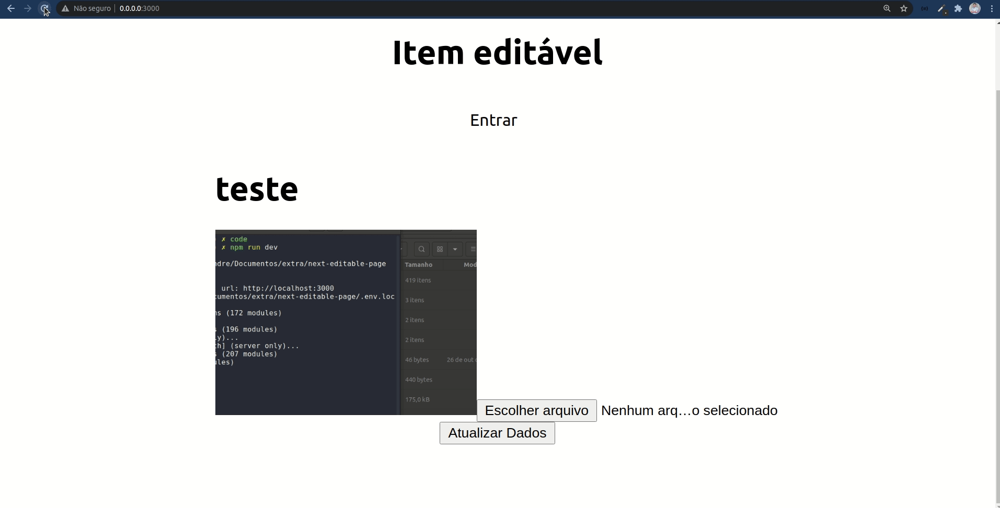

# Next.js editable

Nessa aplicação é possível editar os itens na página sem precisar editar diretamente no código, similar ao Wordpress. Os itens editáveis são armazenados em uma planilha do Google e a imagem é salva no imgur.



## Utilização
Para poder utilizar a função de fazer o upload de imagem execute a aplicação na porta:

```bash
0.0.0.0:3000
```

Para executar a aplicação:

```bash
npm run dev
# or
yarn dev
```